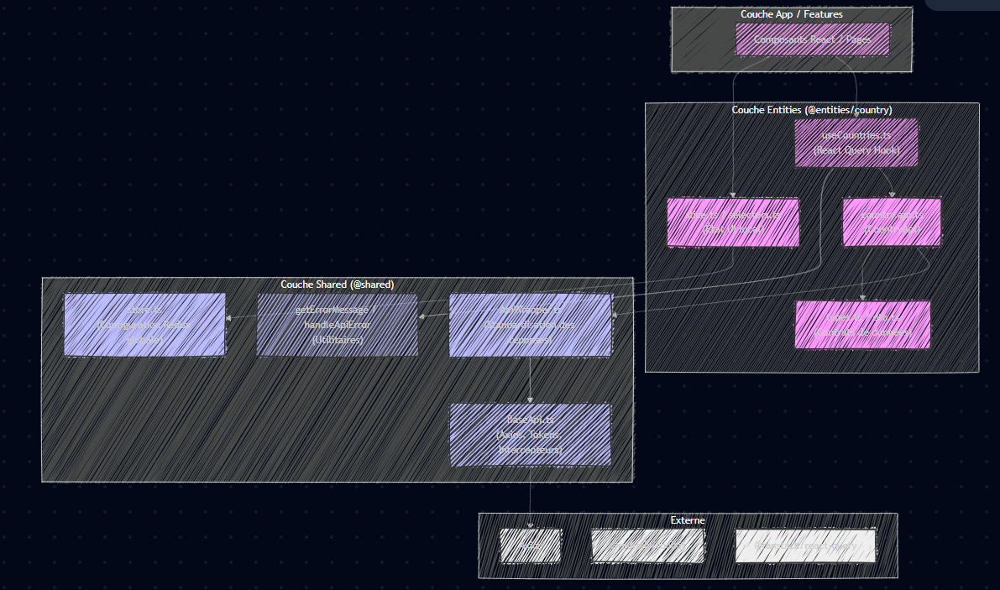

# Project Architecture & Entity Generation Guidelines

This document defines the strict architectural rules for this project. When generating new features, entities, or modifying existing code, you MUST adhere to these guidelines. The architecture is heavily inspired by Feature-Sliced Design (FSD) principles.

## 🏗️ 1. Layered Architecture & Dependency Rules

The project is divided into strict layers. Dependencies MUST only flow downwards.

1. **App / Features Layer** (`@features/`, `@pages/`): UI components, pages, and complex business flows. Can import from `@entities` and `@shared`.
2. **Entities Layer** (`@entities/<entity-name>`): Business domain models (e.g., `Country`, `Student`). Contains API calls, React Query hooks, Redux UI slices, and DTOs. Can ONLY import from `@shared`.
3. **Shared Layer** (`@shared/`): Reusable, domain-agnostic utilities. Contains `api` (BaseApi, ApiWrapper), `lib` (error handlers, i18n), `ui` (generic components), and `store` (Redux configuration). Can ONLY import from external libraries.
4. **External**: Third-party libraries (Axios, Redux Toolkit, TanStack React Query).

🚫 **STRICT RULES:**
- `@shared` MUST NEVER import from `@entities` or `@features`.
- `@entities` MUST NEVER import from other `@entities` directly (use `@shared` or `@features` for orchestration if needed).
- NEVER use `any`. Use `unknown` and narrow the type, or define strict interfaces.

---

## 📦 2. State Management Rules (CRITICAL)

You MUST strictly separate Server State from UI State.

- **Server State (Data Fetching, Caching, Mutations)**: MUST be handled exclusively by **TanStack React Query v5**.
    - NEVER put API data arrays or objects (e.g., `countries: Country[]`) into Redux.
    - Use `useQuery` for fetching and `useMutation` for creating/updating/deleting.
- **UI State (Local component state or shared UI state)**: MAY be handled by **Redux Toolkit** OR local `useState`.
    - Redux slices in `@entities` should ONLY contain UI-specific state (e.g., `selectedEntityId`, `isModalOpen`), NEVER the actual data fetched from the API.

---

## 🧬 3. The "Golden" Entity Template

When asked to create a new entity (e.g., `Student`), you MUST generate the following file structure and adapt the code exactly as shown below, replacing `<Entity>` with the entity name (e.g., `Student`).

### 3.1. Barrel File (`@entities/<entity>/index.ts`)
```typescript
export * from './api/<entity>.api';
export * from './lib/use<Entity>s';
export * from './model/types';
export * from './model/dto';
export * from './model/selectors';
export * from './model/slice';
```


 https://mermaid.ai/play?utm_source=mermaid_live_editor&utm_medium=share#pako:eNqVVNtu2zAM_RVDe2kBNQkS5-YORbu2wwq0wNYLBmzZg2IziRZF8iQZS1b0A_Yp_Y7-2CjJSW13KDa_WDokD8lD2vckVRmQhMw1yxfR7dlERviYYhqAkzy_ZBvQ0dcJOVVFugAHRe3oPTBbaDAT8i2EuOfuwrutcmWYtCa6BpZadP7I5hVPkNlENvKcS8vtppnKoxxMtHcM5bGdqkJavdmvJf6g1BLDCgOn3oyOLWveTnX7aC8U8akAvfF-9ciTnGNgSdpiOd_FBaYNOtQjbiyzgDFG8BTQG_szICC1Sj8nffqNXqhHJFTKRJ3gChUXBhnsJvd1IkNmVSUx5mUIZxBlSsqnRzD7r6p3s2AasqZ6AUXtjD-86PszxuagMeD5sisCu5QZ0xk3zHIlsRYT6afHXElTrcY975iBIGN52pGcrLkyNLpVS5D4vpAWdAq5hUI3OC75FOPnYM-1VvoKjMGVQV0WWIVwnB4PrHeWC24Z181CbnAEfjLuXZVzxueFDn1cQ1aso7lQUybgdVXP11iuZGKnawCglhMx36VT0b2bRp8PjcfaHb6btlVKLLl96Ydb6pfUOaP4xrJ02dYOPvjh8L_Vigt2cHDk17oG-B0NiLN5DEUMCB62QDn1HV7evbkcZrCVF2_Ythwsdc6w2wHzRZTl4EAa5eDEqwSpYMacwSwSTu1Td4tmXIjkzWw8o8Zq3KHkTa_XK88HP3lmF0k3Xx82CMK2Vxmm0_9jgLWthgPAv4RXSHAM1DVKURbqZaBBmEp31aQV6WmpNEV9qNet2lAtaDsHul0zWtujXRuHhOLvnWcksboASlagV8xdyb2jw__QAla41Qke8ZNfTshEPmBMzuQXpVbbMK2K-YIkMyYM3oo8w7bOOMNvZbVDNe4m9uf-nCQZ9TwHSe7JmiT9uNUZd7qd_ngwiIejUZeSDUl6w9ag0-v2xvF4EOMzfKDkl0_aaY0G8XgUd-P-aNiNx_3Bwx9NvSlB